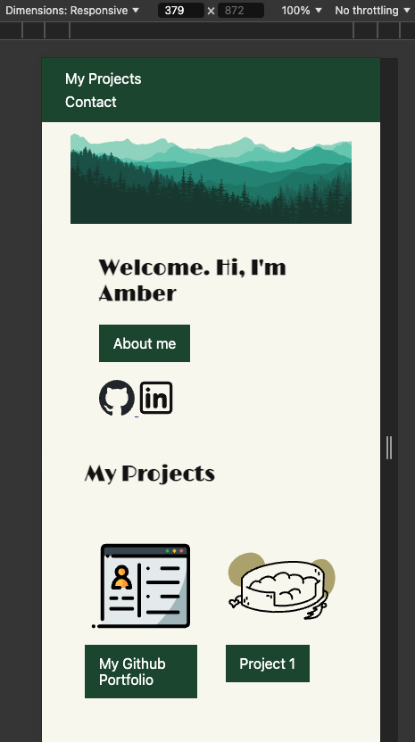
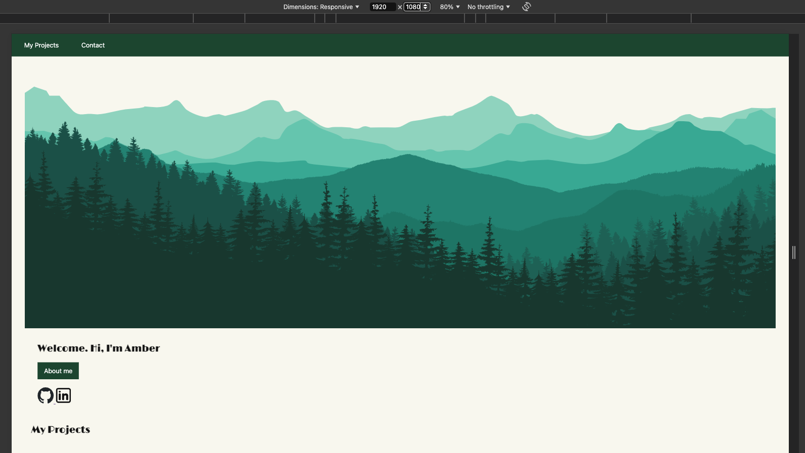
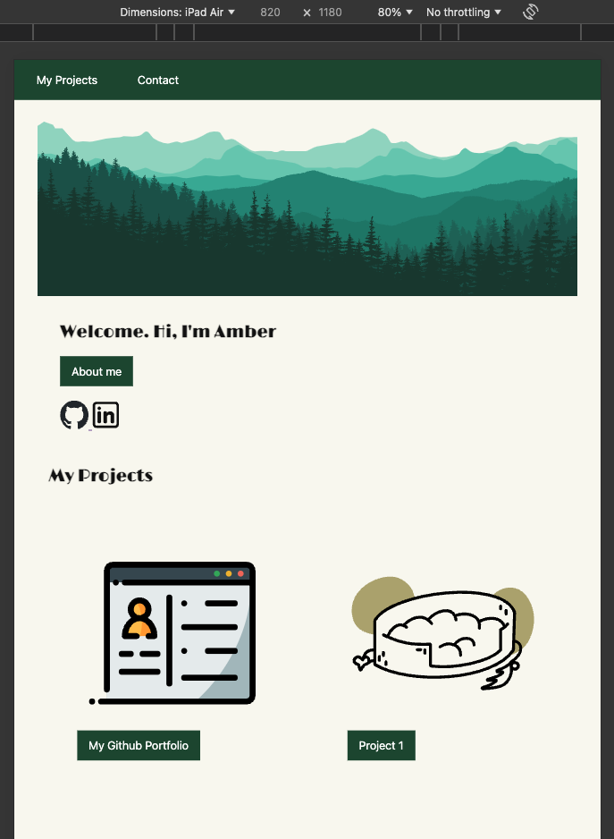
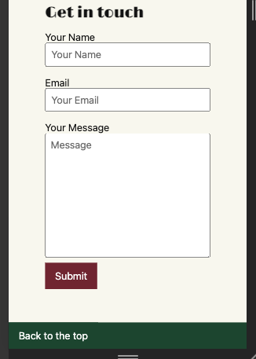
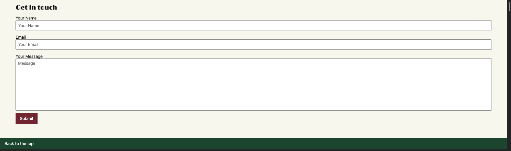
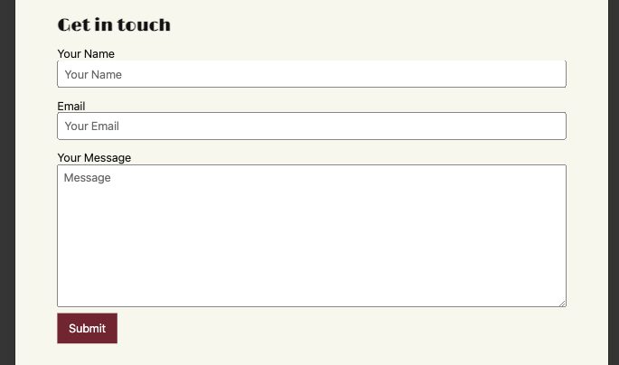
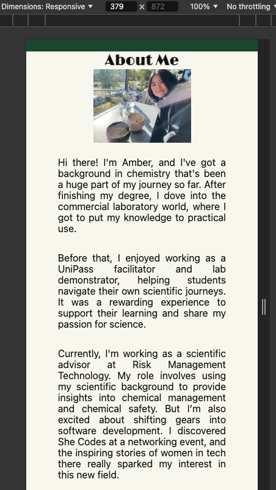
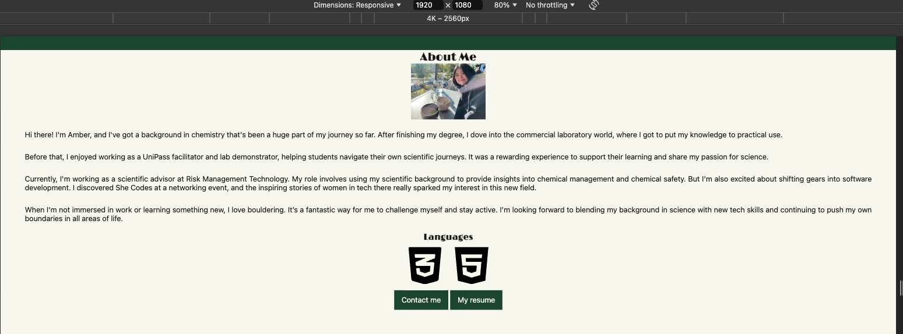
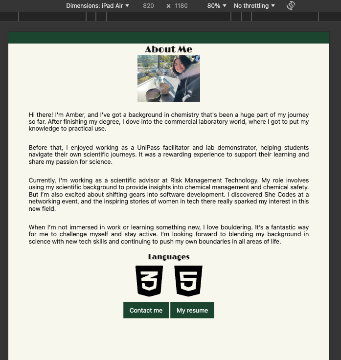
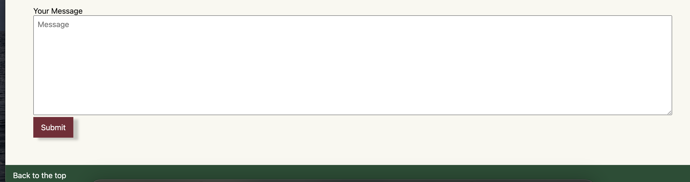

#  your_name_here - Portfolio Task
​
[My portfolio site] https://ambo-n.github.io/# 
​
## Project Requirements

### Content
 Add a short paragraph describing the features below. What aesthetic and technical choices did you make?

- [x] At least one profile picture
- [x] Biography (at least 100 words)
- [x] Functional Contact Form
- [x] "Projects" section
- [x] Links to external sites, e.g. GitHub and LinkedIn.
​
This is a portfolio website created using HTML/CSS. It aims to showcase the projects I've worked on and provide more information about myself. Within this website, you can find these following information:

    - A little bit about who I am and my resume (will need to be linked)
    - The projects I've worked on
    - A contact form to contact me
    - Further links to LinkedIn and Github if you would like to connect

The wireframes were designed using Figma. The front page contains an 'About Me' link that is easily noticeable to the users which leads to the second webpage dedicated for the about me section. A navigation tab is available in the header so users can easily skip to areas of interest. Links to external sites such as GitHub and LinkedIn are embedded in the social icons which users can click to access the webpage. As I have not worked on any other projects, random images were used as dummies. A contact form with placeholders is used to give the users an option to get in touch.

### Technical
 Add a short paragraph describing the features below. What strategies or design decisions did you work from? 
- [x] At least 2 web pages.
- [x] Version controlled with Git
- [x] Deployed on GitHub pages.
- [x] Implements responsive design principles.
- [x] Uses semantic HTML.

This portfio contains two webpage: the main page and the about me page. All changes are tracked and managed using Github. The website is deployed on Github Pages. My website is responsive on mobile (379px) and laptop screens. I have worked on mobile design first then made sure that everything display as expected on larger screens using media queries.

### Bonus (optional)
 Add a short paragraph describing the features below, if you included any. 
- [x] Different styles for active, hover and focus states.
- [ ] Include JavaScript to add some dynamic elements to your site. (Extra tricky!)
​
Hover shadow effect was added for the Submit button in Contact Form.

### Screenshots

####  Phone Hero 

#### Desktop Hero

#### Tablet Hero

#### Phone Contact Page

#### Desktop Contact Page

#### Tablet Contact Page

#### Phone About-Me

#### Desktop About-Me

#### Tablet About-Me

#### Hover effect on Submit button

